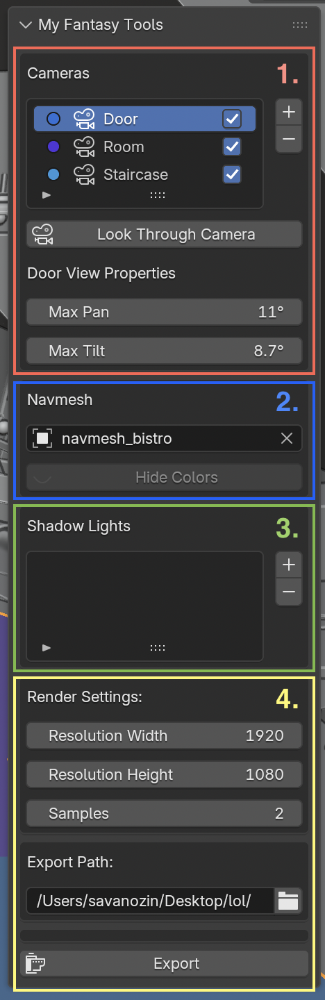
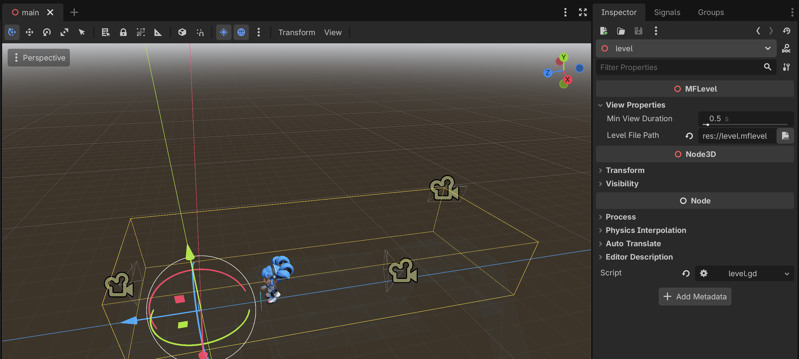

# Usage Tutorial

This guide walks through the full pipeline: setting up a scene in Blender, exporting it as an MFT level, and loading it in Godot.

## Installation

Pre-built binaries for Windows, macOS, and Linux are available on the releases page. Alternatively, you can [build from source](building.md) and use the installed output directories directly.

### Blender Plugin

Download the archive or zip the contents of the `mft_blender_addon` directory and install it via **Edit > Preferences > Add-ons > Install from Disk**.

### Godot Plugin

Copy files into your Godot project's `addons/` folder and enable it in **Project > Project Settings > Plugins**.

---

## Blender: Setting Up a Scene

Open your scene in Blender. The **My Fantasy Tools** panel appears in the 3D viewport sidebar (press **N** to open it).

The panel has four sections:

1. **Cameras**: Lists all camera views for this level. Use **+** / **−** to add or remove cameras. Check the box next to each camera to include it in the export. With a camera selected, **View Properties** has extra view-specific settings.

2. **Navmesh**: Assign the mesh object that defines the walkable floor. Click **Show/Hide Colors** to toggle navmesh visualization in the viewport.

3. **Shadow Lights**: List the lights that can cast realtime shadows.

4. **Render Settings**: Control the export quality. Set the **Export Path** to the folder where the `.mflevel` file and baked images will be written.

---

## Blender: Camera Preview

Select a camera in the **Cameras** list and click **Enter/Exit Camera View** to toggle the pre-rendered view framing live in the viewport.

Two rectangles are shown:

- **Camera Rotation Bounds**: The full area of the pre-rendered background image, covering all possible pan/tilt offsets.
- **Camera Viewport Size**: The visible window the player actually sees at any given moment.

Adjust **Max Pan** and **Max Tilt** in the panel to control how much the player can rotate the camera view. The yellow bounding box updates in real time to show how much extra background needs to be rendered to cover the full rotation range.

---

## Blender: Exporting

Once your cameras, navmesh, and lights are configured, set the **Export Path** and click **Export**. This will:

1. Render the background image(s) for each enabled camera at the specified resolution and sample count.
2. Bake depth and lighting data.
3. Write the `.mflevel` file containing all scene data.

---

## Godot: Loading a Level

Add an **MFLevel** node to your scene by drag and dropping the `.mflevel` from your file browser into the Godot viewport.

The `MFLevel` node will load the level and spawn a camera icons for each camera view defined in the export. Key properties:

- **Level File Path** — Path to the `.mflevel` file (e.g. `res://level.mflevel`).

Attach a script to the `MFLevel` node to drive camera transitions, player movement on the navmesh, and any other game logic.
